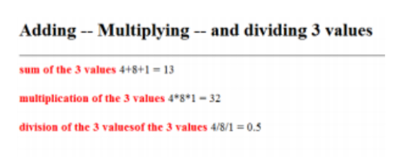

# Question 1

### Write your own function that can add n values ensure that all passing parameters are numerical values only.

# Question 2

### Write a script to determine whether the entered string is palindrome or not. Ask the user whether to consider case of the entered string or not, handle both cases in your script i.e. RADAR NOON MOOM are palindrome. Note: raDaR is not a palindrome if user requested considering case of entered string.

# Question 3

### write a script that accepts a string from user through prompt and count the number of ‘e’ characters in it.

# Question 4

### Write a script that reads from the user his info; validates and displays it with a welcoming message.(name,phone,email,)

# Question 5

### Fill an array of 3 elements from the user, and apply each of the following mathematicaloperations on it (+, \*, /). Format the output as shown in Fig

